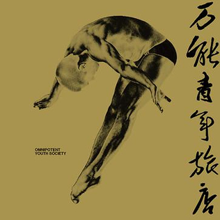

## Recommended Albums

### _The Dark Side of The Moon_, by Pink Floyd

{: style="height:auto;width:300px"}

A masterpiece presented by the famous progressive rock band Pink Floyd in 1973, which talks about
time, death, money, mental instability and all the things that concerns us. It is the
ultimate combination of music and literature. The guitar solo composed and performed by David Gilmour
is just breathtaking, while the synthesizer part by Richard Wright can really bring you to the outer space. 
And above all, it is the thought provoking lyrics by Roger Waters that defines this album. 
Take a quiet afternoon, put on your best headset, and ride with the band on the 40 minutes non-stop
journey across the universe.

### _Big Wave_, by Tatsuro Yamashita

{: style="height:auto;width:300px"}

A great hit from Tatsuro Yamashita, the representative songwriter who established a new genre
named City Pop. The album merges American surf rock with Japan's own music style, which 
creates a unique listening experience. It sounds like a cool breeze in a summer afternoon.
Probably the best album to be played while driving along the west coast in your sportscar.

### _Omnipotent Youth Society_, by Omnipotent Youth Society

{: style="height:auto;width:300px"}

The first album from the best Chinese rock band Omnipotent Youth Society. After years of dedication,
they had presented the golden standard of Chinese rock music. The trumpet, the drumbeat and the guitar
riffs are well composed and perfectly organized. Personally speaking, the best piece of the album is _Qinhuangdao_.

## About My Gear

This is a custom built Fender Stratocaster (or Partscaster to be precise) tributes to David Gilmour's black strat.
It has a Fender custom shop 1969 body and a Musikraft made 1963 spec rosewood neck. The body is refinished in
california blue.

