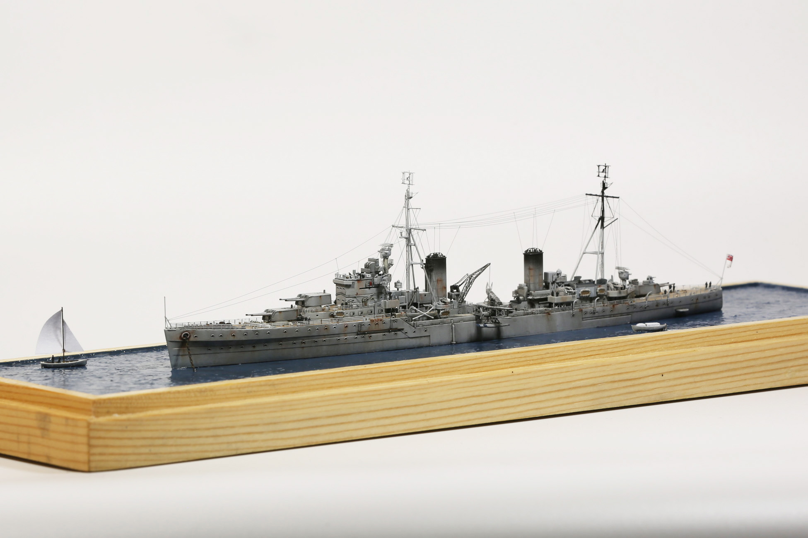
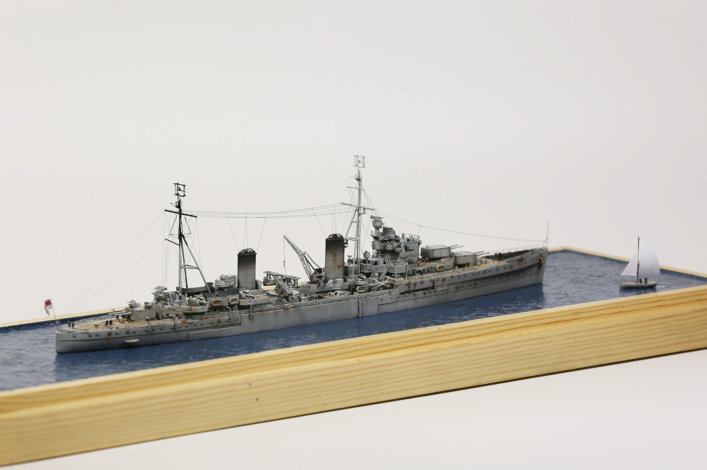
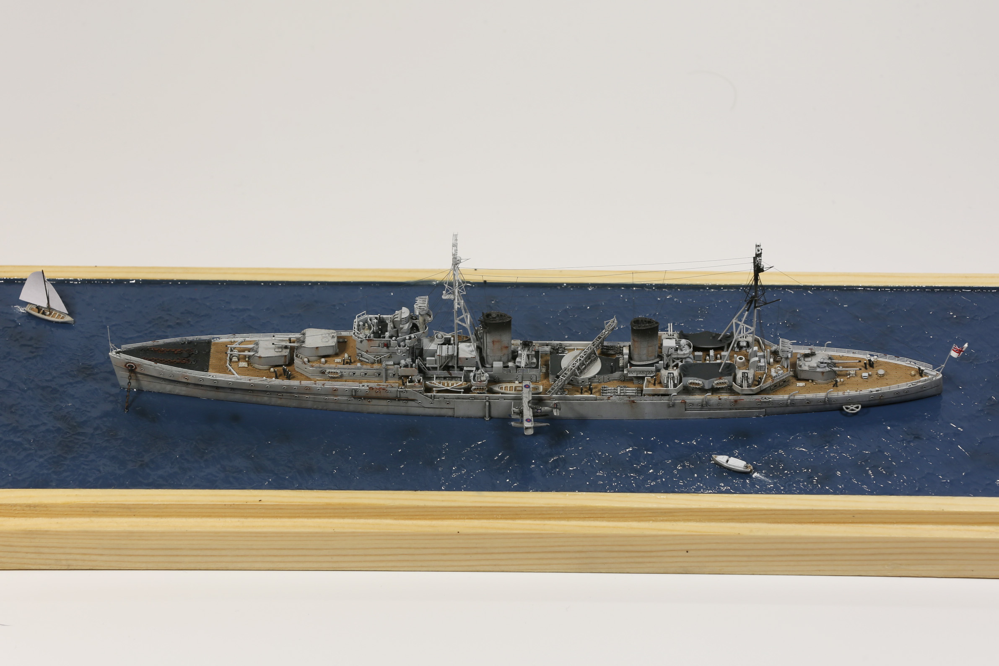
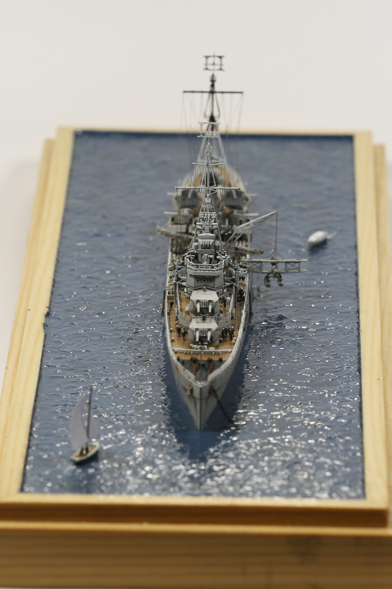
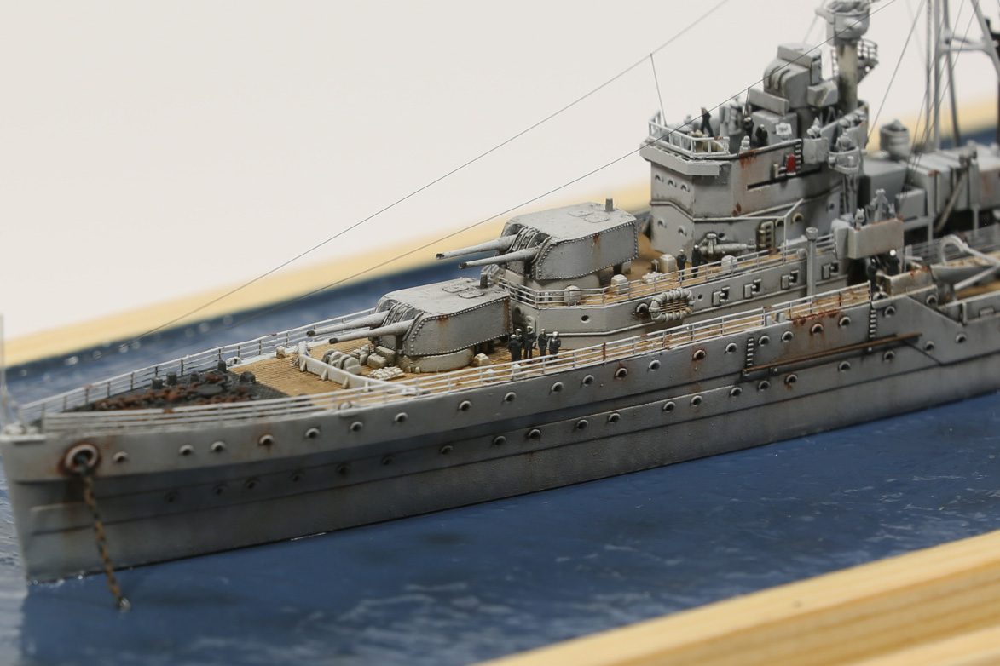
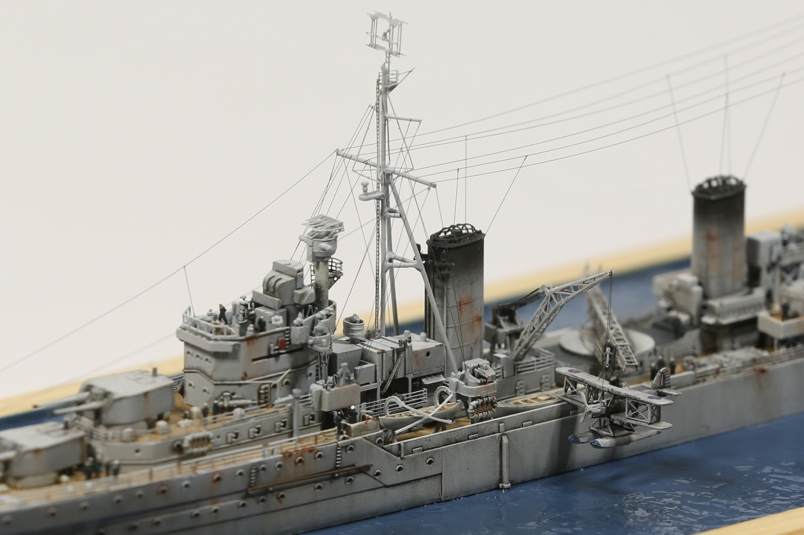
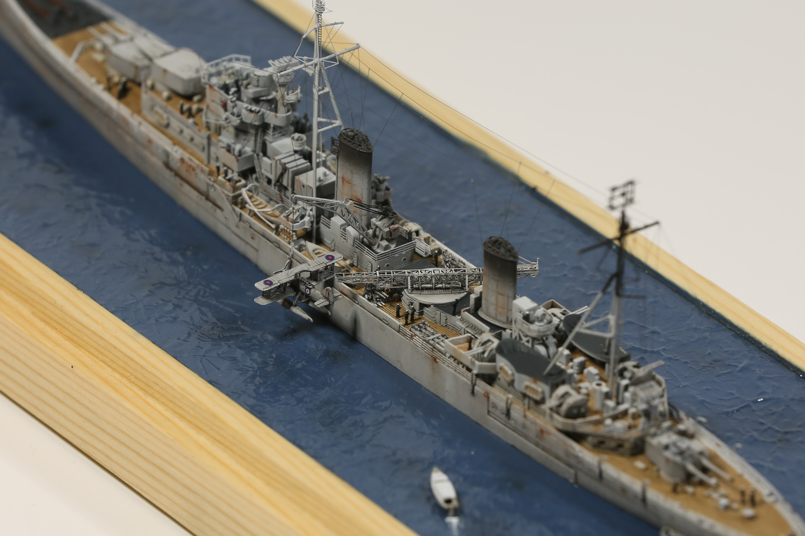
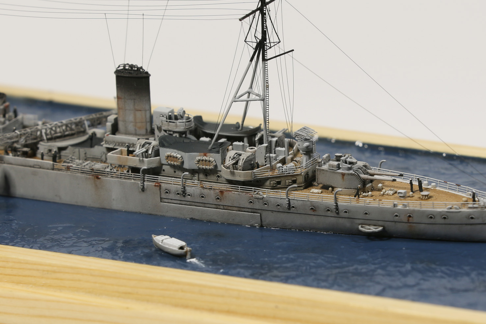
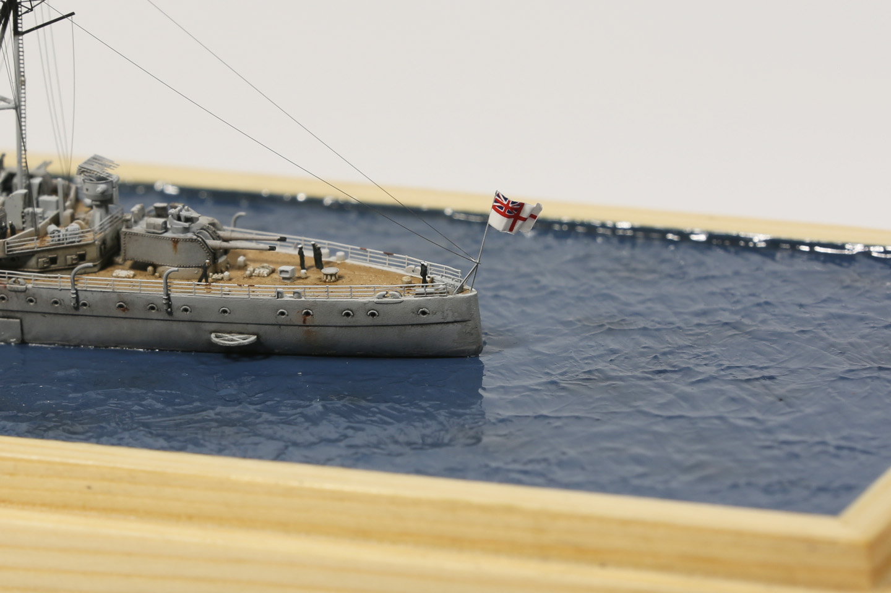
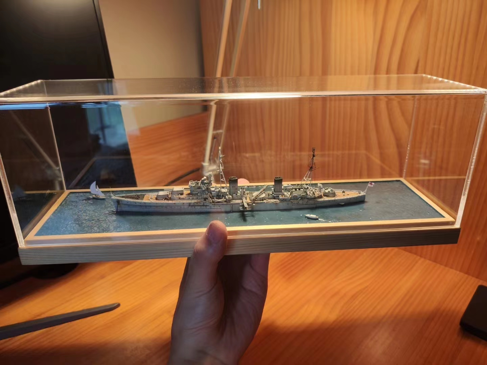

## HMS Aurora, in 1/700 scale

This project lasted for nearly 6 months, but the result was satisfactory.

First time trying ship models with photo etched parts.

Dealing with tiny PE parts is a mental torture, I'm glad I made it to the end.

Painting and weathering come straight forward without difficulties.

{: style="height:auto;width:600px" data-gallery="aurora"}

{: style="height:auto;width:600px" data-gallery="aurora"}

{: style="height:auto;width:600px" data-gallery="aurora"}

{: style="height:auto;width:600px" data-gallery="aurora"}

{: style="height:auto;width:600px" data-gallery="aurora"}

{: style="height:auto;width:600px" data-gallery="aurora"}

{: style="height:auto;width:600px" data-gallery="aurora"}

{: style="height:auto;width:600px" data-gallery="aurora"}

{: style="height:auto;width:600px" data-gallery="aurora"}

{: style="height:auto;width:600px" data-gallery="aurora"}
