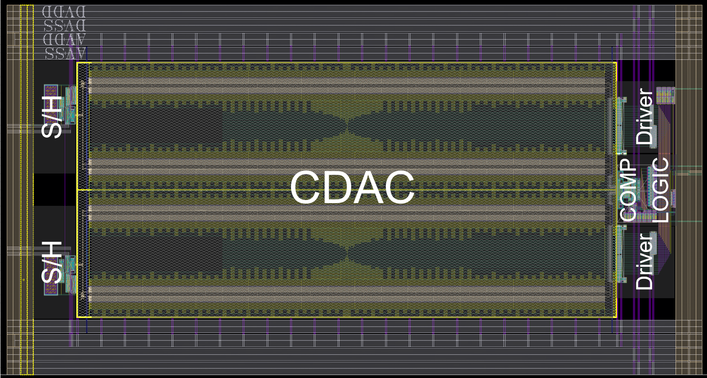
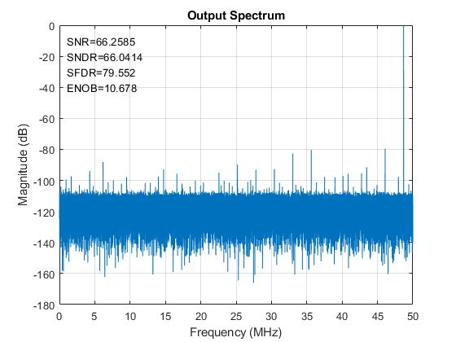
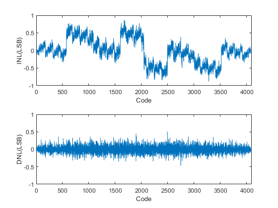
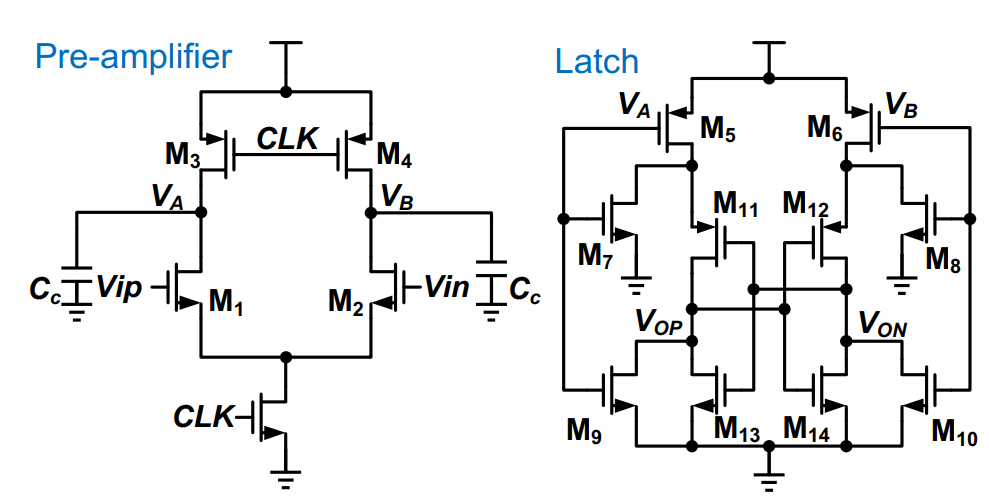
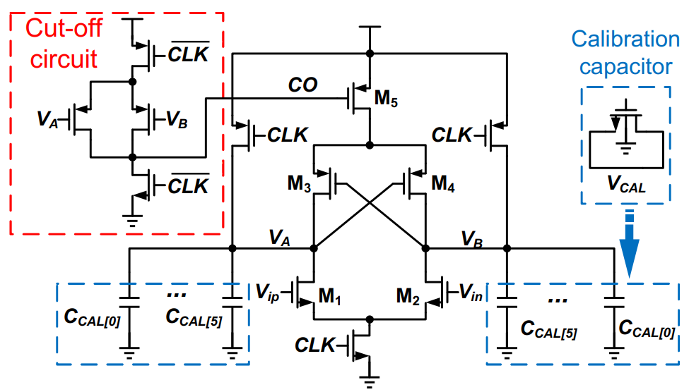
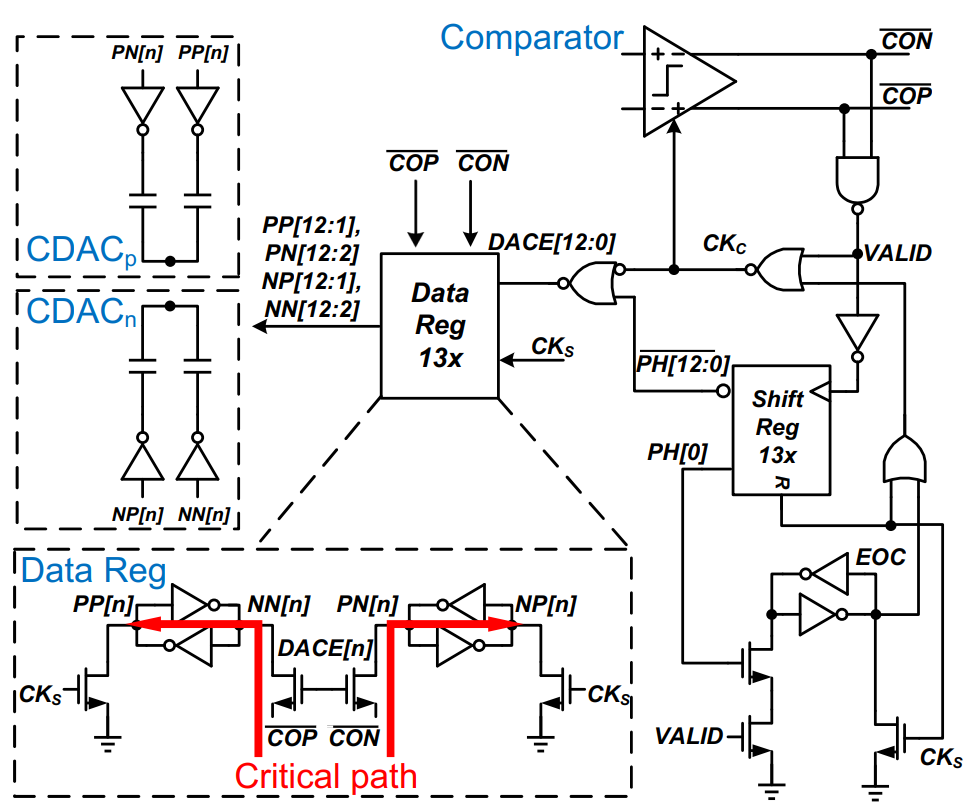
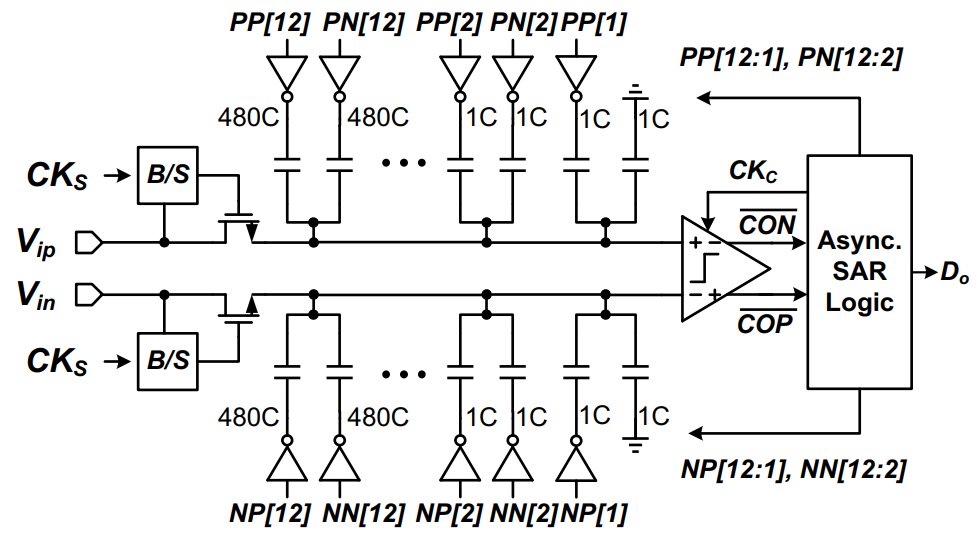
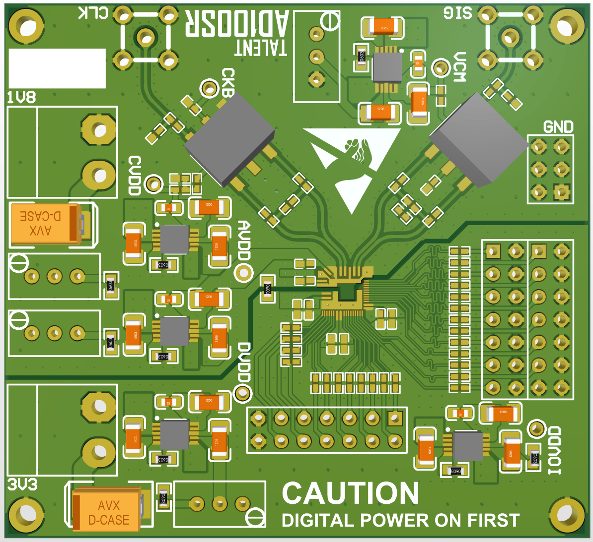

# Apr. 2022 - Present, in ShanghaiTech University

## Overview
* Built a SAR ADC MATLAB model.
* Proposed a gain-boosting dynamic comparator featuring a modified pre-amplifier.
* Designed an asynchronous SAR logic maximizing CDAC settling time.
* Implemented a 12-bit 100 MS/s SAR ADC utilizing the proposed comparator and SAR logic.
* Customized circuit layout with area and mismatch optimization.
* Fabricated in 28-nm CMOS, set up testing system with dedicated PCB and FPGA program.

## The SAR ADC model
Before circuit implementation, it is worth considering to go through a comprehensive research about the circuit. A MATLAB model is a good way to learn about the basic principle of your circuit, which can save you a great amount of time.

The MATLAB model consists of 3 parts. 

* ADC generation. It generates an ADC entity with its own circuit properties including its exact capacitor values, switch resistance, comparator offset and delay.
* ADC behavioural model. It defines the operation of the ADC.
* The Testbench. A sine wave is fed to the generated ADC. The output is obtained and processed using FFT to generate the spectra.

Simulation results of a typical 12-bit SAR ADC using this MATLAB model:

{: style="height:auto;width:600px"}
{: style="height:auto;width:600px"}

## Gain-boosting comparator

A major challenge for the SAR ADC is the energy efficiency of the comparator. For high speed designs, additional power consumption is often traded for low noise and delay, which makes the comparator one of the most power hungry components in the ADC. 

The conventional two-stage dynamic comparator mainly comprises of a pre-amplifier and a regenerative latch. The input signal is amplified in the first stage by integration process. Subsequently, the latch generates
comparison results once it's triggered by the first stage. Noise is dominated by the first stage, since its high gain can suppress the noise from the second stage.

{: style="height:auto;width:600px"}

In this project, a modified dynamic comparator, based on the conventional two-stage design, is presented. Additional cross coupled PMOS pair is introduced to enable positive feedback in the amplifier. It basically changes the transconductance of the first stage.

* The differential transconductance is increased by positive feedback.
* The common mode transconductance is reduced by additional pull up current.

Nevertheless, the introduction of the cross coupled pair will produced static current in steady state, producing unwanted power overhead. Therefore, a cutoff circuit is embedded to cut off M5 after the pre-amplifier
enables the regenerative latch.

{: style="height:auto;width:600px"}

The simulation results show a 35% reduction in power in comparison with the conventional design, under the same speed and noise requirement.

## Low delay SAR logic
In general, the cycle time of 1-bit conversion operation in an asynchronous SAR ADC is the summation of the comparator resolving time and the delay of the timing logic, where the
latter is reserved for both SAR logic delay and CDAC settling. However, both high sampling frequency and high resolution result in limited SAR cycle time, which leaves less CDAC
settling time.

To address this issue, a SAR logic aimed to minimize logic delay is proposed. In each conversion cycle, a phase is selected by PH signal via the shift registerThe data register is activated simultaneously with the comparator, so the comparison results can be captured once generated. 

The critical path delay of the proposed SAR logic is only the combination of an inverter delay and a pass transistor delay.

{: style="height:auto;width:600px"}

## Implementation
The 12-bit 100MS/s SAR ADC is implemented in 28-nm CMOS. Firstly, the sampling switches are both bootstrapped, which increases the
linearity of sampled signals. In view of the CDAC array, 1-bit redundancy is introduced to reduce the impact of incomplete
settling. Meanwhile, to save switching energy, the CDAC array utilizes split monotonic scheme, except for the LSB capacitor. 
The calibration of CDAC mismatch and comparator offset are conducted off-chip for flexibility.

{: style="height:auto;width:600px"}

As for the layout, it is mostly optimized for minimum circuit loading. The data registers are placed adjacent to the comparator. Additionally, the
data registers are implemented using custom layout to further reduce loading of the comparator.

Most of the chip area is occupied by the CDAC, since the ADC is SAR-only and the resolution is high for such architecture.

{: style="height:auto;width:600px"}

## Measurement setup

I designed a dedicated PCB for testing. The chip is bonded in the center of PCB. The input signal and the clock is generated using RF signal generators, filtered with band pass filter. The single-ended signals are converted to differential using balun. The input impedance of the system is matched with respect to 50 Ohm. For noise reduction, analog ground is separated with the digital ground. Besides, low noise LDOs are chosen as power supplies.

{: style="height:auto;width:600px"}

## See also

Publications related to this project can be accessed here.
