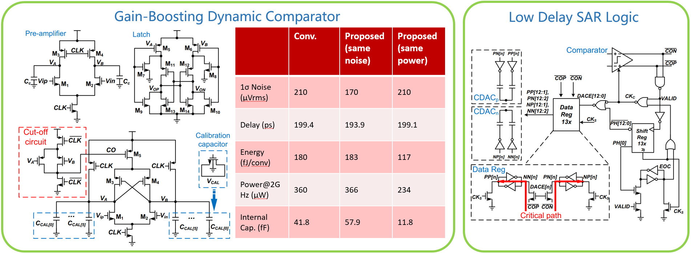
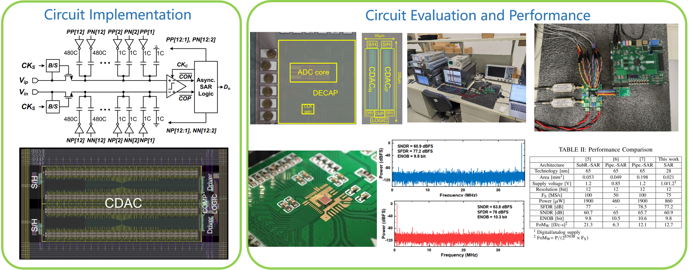

Apr. 2022 - Present, in ShanghaiTech University

## Overview

Currently, a critical challenge of high-performance SAR ADCs lies in the energy efficiency of the comparator. In the case of medium resolution SAR-only ADCs, the comparator is the primary source of noise, thereby limiting the dynamic performance. In terms of high-speed designs, additional power consumption is often required to achieve the noise and speed benchmarks, which make the comparator one of the most power-intensive components in the entire ADC. 

In this project, I proposed a SAR ADC features a gain-boosting dynamic comparator design and a low-delay SAR logic. The presented comparator incorporates a positive feedback in the pre-amplifier, which enables a high gain during the integration phase, thereby improving the energy efficiency. Meanwhile, to ensure a sufficient settling time for the internal CDAC, an asynchronous SAR logic with a low logic delay in the SAR logic loop is implemented. Accordingly, a prototype ADC is manufactured using the 28-nm CMOS technology, which achieves a power consumption of 860 $\mu$W at 75 MHz sampling frequency. Moreover, the measured SNDR of the prototype at Nyquist frequency is 60.9 dB, which translates to a Walden figure of merit (FoMw) of 12.7 fJ/conversion-step.

**PLEASE CLICK THE IMAGES TO ENLARGE.**

{: style="height:auto;width:900px"}
{: style="height:auto;width:900px"}

## See also

Publications related to this project\:

*  R. Chen A. Lee, Y. Hu, H. Xu,  X, Kou." A 12-bit 75 MS/s Asynchronous SAR ADC with Gain-Boosting Dynamic Comparator." IEEE International Symposium on Circuits and Systems (ISCAS), 2024 (accepted, [preprint](./doc/A 12-bit 75 MSs Asynchronous SAR ADC with.pdf)).

