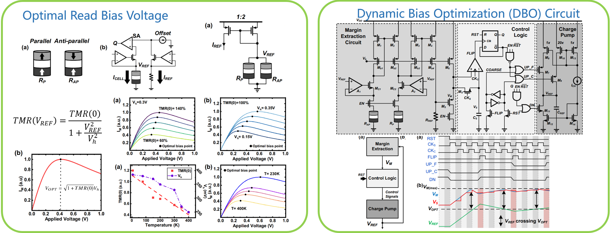
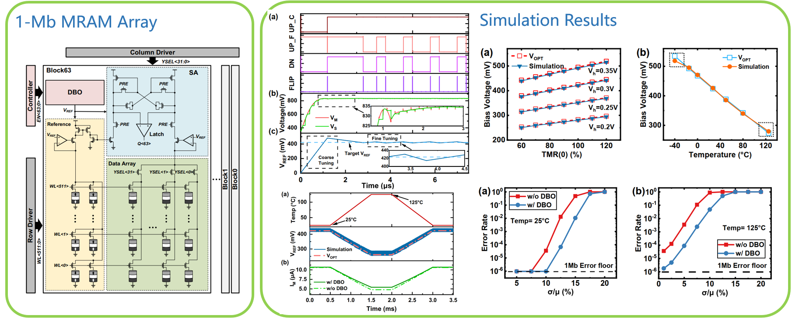

Jun. 2022 - Present, in ShanghaiTech University.

## Overview

A major challenge for MRAM read operation is the small tunneling magnetoresistance ratio (TMR) which characterizes the resistance difference between the parallel (P) and anti-parallel (AP) states. This, along with process-voltage-temperature (PVT) variations, results in narrow sensing margins which are inevitably vulnerable to thermal noise and circuit mismatch-induced offset, therefore causing read errors. As for read-disturbance-free MRAMs like SOT and VCMA, sensing margin can be enlarged by raising the readout voltage. However, the TMR ratio normally displays a negative correlation with the bias voltage, and it also changes under temperature and process variations. 

In this project, I proposed a dynamic bias optimization (DBO) circuit to enable the real-time tracking of the optimal read voltage across PVT variations within an MRAM array. It optimizes read performance by adjusting the read bias voltage dynamically for maximum sensing margin. Simulation results on a 28-nm 1Mb MRAM macro show that the tracking accuracy of the proposed DBO circuit remains above 90% even when the optimal sensing voltage varies up to 50%. Such dynamic tracking strategy further results in up to two orders of magnitude reduction in the bit error rate with respect to different variations, highlighting its effectiveness in enhancing MRAM performance and reliability.

**PLEASE CLICK THE IMAGES TO ENLARGE.**

{: style="height:auto;width:900px"}
{: style="height:auto;width:900px"}

## See also

Publications related to this project\:

*  R. Chen, A. Lee, Z. Wang, D. Wu, X. Kou. "A Read Margin Enhancement Circuit with Dynamic Bias Optimization for MRAM." IEEE Transactions on Circuits and Systems II - Express Briefs ([IEEE Xplore](https://ieeexplore.ieee.org/document/10440550)).
